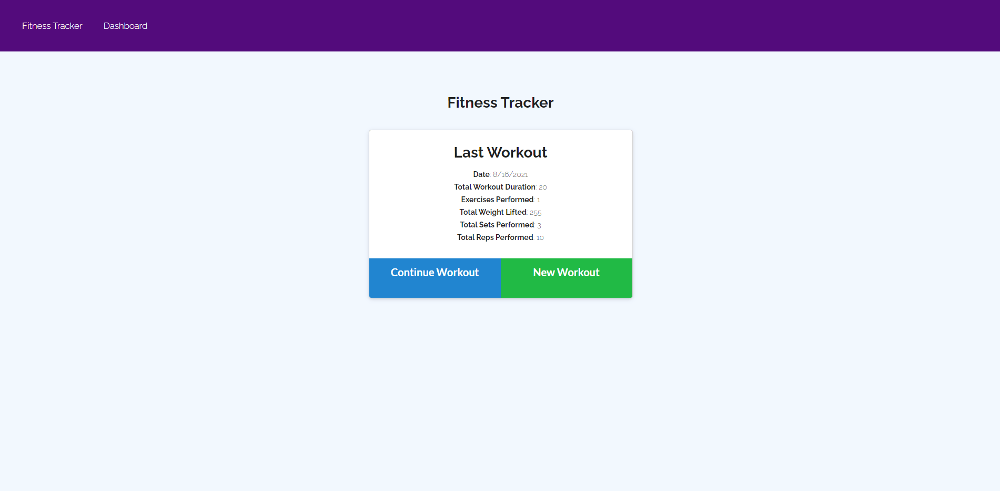
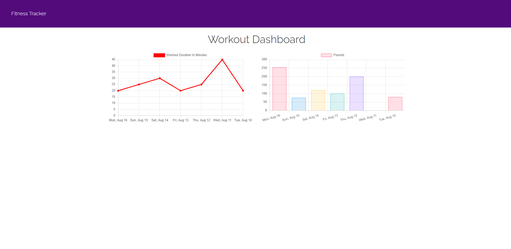

# Fitness-Tracker

---

## Description

This app is used to track fitness activity of the user and display recent results for the past 7 days in graphical format on the dashboard page. Designed for those looking for motivation to keep going with their fitness routine.

---

## Table of Contents

- [Technology Used](#technology-used)

- [Links](#links)

- [Screenshot(s)](#screenshots)

- [Info](#info)

- [License](#license)

---

## Technology Used

- [Visual Studio Code](https://code.visualstudio.com/)
- [Node.js](https://nodejs.org/en/)
- [MongoDB](https://www.mongodb.com/)
- [Mongoose](https://mongoosejs.com/)
- [Express package](https://www.npmjs.com/package/express)
- [GitHub GUI](https://desktop.github.com/)
- [GitHub](https://www.github.com)
- [Heroku](https://www.heroku.com)

---

## Links

- [GitHub Repository](https://github.com/EinsteinDG/Fitness_Tracker_Homework)
- [Deployed Application](https://the-fitapp-tracker.herokuapp.com/)

---

## Screenshot(s)

---

## Info

You can find more of my work at [Github](https://github.com/EinsteinDG)

---

## License

This project is licensed under the [MIT License](https://choosealicense.com/licenses/mit).

Copyright (c) 2021 EinsteinDG

Permission is hereby granted, free of charge, to any person obtaining a copy of this software and associated documentation files (the "Software"), to deal in the Software without restriction, including without limitation the rights to use, copy, modify, merge, publish, distribute, sublicense, and/or sell copies of the Software, and to permit persons to whom the Software is furnished to do so, subject to the following conditions:

The above copyright notice and this permission notice shall be included in all copies or substantial portions of the Software.

THE SOFTWARE IS PROVIDED "AS IS", WITHOUT WARRANTY OF ANY KIND, EXPRESS OR IMPLIED, INCLUDING BUT NOT LIMITED TO THE WARRANTIES OF MERCHANTABILITY, FITNESS FOR A PARTICULAR PURPOSE AND NONINFRINGEMENT. IN NO EVENT SHALL THE AUTHORS OR COPYRIGHT HOLDERS BE LIABLE FOR ANY CLAIM, DAMAGES OR OTHER LIABILITY, WHETHER IN AN ACTION OF CONTRACT, TORT OR OTHERWISE, ARISING FROM, OUT OF OR IN CONNECTION WITH THE SOFTWARE OR THE USE OR OTHER DEALINGS IN THE
SOFTWARE.

---
